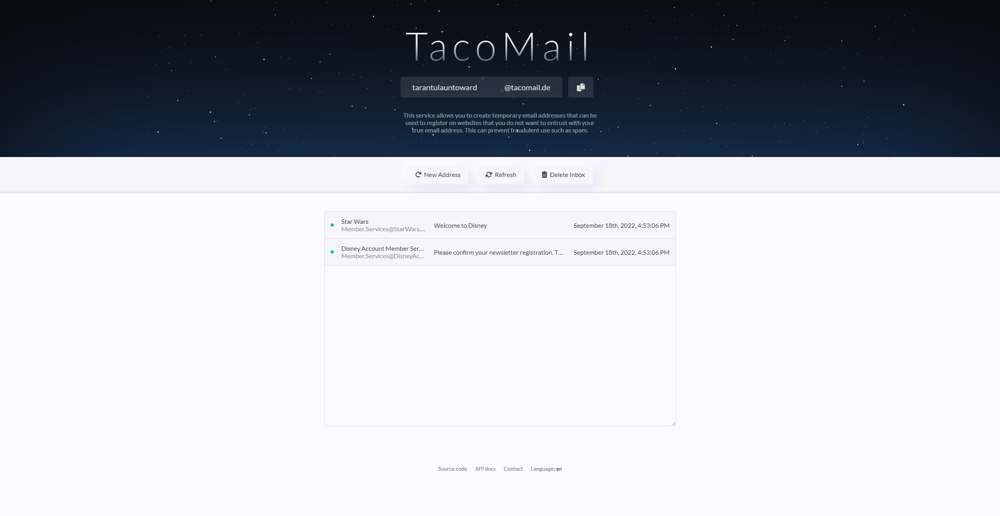
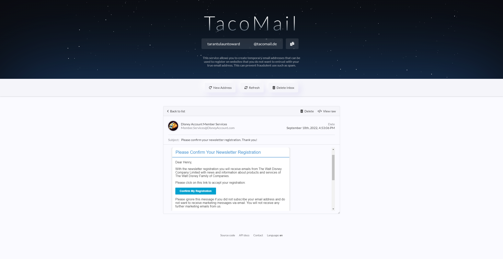

# TacoMail
This service allows you to create temporary email addresses that can be used to register on websites that you do not want to entrust with your true email address. This can prevent fraudulent use such as spam.

The live version can be found at [https://tacomail.de](https://tacomail.de).

## Features
- Anonymously receive emails.
- HTML emails are displayed correctly without compromising security.
- Email attachments can be downloaded.
- All emails will be deleted after 1 hour.
- Simple API that can be integrated into other projects. Checkout [API.md](docs/API.md) for more information.

## Setup
1. Clone this repository using `git clone https://github.com/oskar2517/tacomail`
2. Navigate into the newly created directory using `cd tacomail`
3. Install the dependencies required by the server using `npm install`
4. Navigate into the client directory using `cd client`
5. Modify `public/tos.txt` to your needs
6. Install the dependencies required by the client using `npm install`
7. Build the client using `npm run build`
8. Return to the root directory using `cd ..`
9. Rename `.config.json` to `config.json` and configure to your needs
10. Launch the sever using `node .`

## Screenshots

## Documentation
Please refer to the [API docs](docs/API.md).

## Acknowledgements
- All images inside `client/public/img/authors/*` are generated by [OpenAI's DALL-E 2](https://openai.com/dall-e-2/).
- The background of the website's header section is derived from [this CodePen post](https://codepen.io/sarazond/pen/KKVgqy).